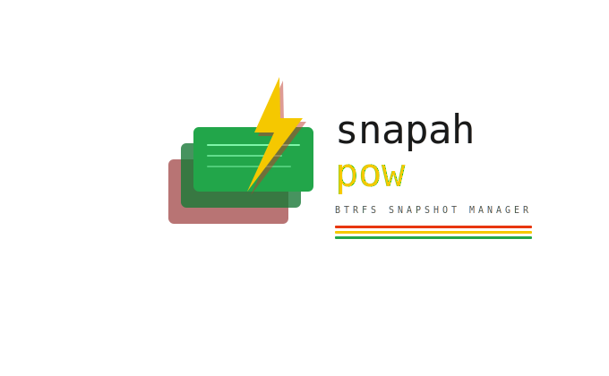

[](https://github.com/johandavid77/btrfs-snapah-pow/actions/workflows/ci.yml)
[](https://github.com/johandavid77/btrfs-snapah-pow/actions/workflows/release.yml)
[](https://github.com/johandavid77/btrfs-snapah-pow/pkgs/container/btrfs-snapah-pow)
[](https://go.dev)
[](LICENSE)

# BTRFS Snapah Pow

<p align="center">
  
</p>


Gestion centralizada de snapshots BTRFS para entornos multi-nodo.
Servidor central + agentes distribuidos + CLI comunicados por gRPC.

## Arquitectura


## Instalacion rapida


## Uso

## CLI - snapah

El CLI tiene dos modos: **TUI interactivo** y **comandos directos**.

### TUI interactivo (sin argumentos)

```bash
./bin/snapah
# o si está instalado:
snapah
```

Navega con `↑↓`, selecciona con `Enter`, vuelve con `Esc`.
Ingresa con `admin` / `admin123` (cambiar en producción).

**Pantallas disponibles:**
- 🖥️  Nodos — lista de agentes conectados
- 📸  Snapshots — todos los snapshots con estado
- 📋  Eventos — log de eventos del servidor
- 📅  Políticas — políticas de retención activas

### Comandos directos (scripting)

```bash
# Ver estado del servidor
snapah status

# Ver versión
snapah version
```

### Variables de entorno del CLI

```bash
# Apuntar a un servidor remoto
export SNAPAH_URL=http://192.168.1.100:8082
snapah
```

---

## Agente - snapah-agent

El agente se instala en cada nodo BTRFS y se registra automáticamente con el servidor.

```bash
# Iniciar el agente
SNAPAH_SERVER=192.168.1.100:9091 \
SNAPAH_TOKEN=tu-token-secreto \
SNAPAH_NODE_NAME=nodo-1 \
./bin/snapah-agent

# Con Docker
docker run -d \
  --privileged \
  -e SNAPAH_SERVER=192.168.1.100:9091 \
  -e SNAPAH_TOKEN=tu-token \
  -e SNAPAH_NODE_NAME=nodo-1 \
  ghcr.io/johandavid77/btrfs-snapah-pow:latest \
  ./bin/snapah-agent
```

---

## Servidor - snapah-server

```bash
# Inicio básico
./bin/snapah-server

# Con configuración personalizada
SNAPAH_ADMIN_PASSWORD=mi_password \
JWT_SECRET=$(openssl rand -hex 32) \
DATABASE_URL=data/snapah.db \
./bin/snapah-server

# Ver logs en tiempo real
tail -f /tmp/snapah.log

# Endpoints disponibles
# HTTP:    http://localhost:8082
# gRPC:    localhost:9091
# Metrics: http://localhost:9093/metrics
# WS:      ws://localhost:8082/ws/events
```


## REST API

| Metodo | Endpoint              | Descripcion               |
|--------|-----------------------|---------------------------|
| GET    | /health               | Estado del servidor       |
| GET    | /api/nodes            | Listar nodos              |
| GET    | /api/snapshots        | Listar snapshots          |
| POST   | /api/snapshots        | Crear snapshot            |
| POST   | /api/snapshots/delete | Eliminar snapshot         |
| GET    | /api/events           | Eventos recientes         |
| GET    | /api/policies         | Listar politicas cron     |
| POST   | /api/policies         | Crear politica programada |

## Crear snapshot via API


## Variables de entorno

| Variable      | Descripcion                 |
|---------------|-----------------------------|
| SNAPAH_SERVER | Direccion del servidor gRPC |
| SNAPAH_TOKEN  | Token de autenticacion      |
| SNAPAH_CONFIG | Ruta al config.yaml         |

## Estructura


## Licencia

GPL3 2026 Johan David
---

## Roadmap

### v0.1.0 — Base funcional (actual)
- [x] Arquitectura servidor + agente + CLI
- [x] gRPC con Protocol Buffers
- [x] Crear, listar y eliminar snapshots BTRFS
- [x] Registro y heartbeat de nodos
- [x] SQLite embebido con GORM
- [x] Scheduler con expresiones cron reales
- [x] Retención automática de snapshots
- [x] REST API completa
- [x] Streaming de eventos gRPC
- [x] Instalación como servicio systemd
- [x] IDs con UUID (sin colisiones)

### v0.2.0 — Seguridad y autenticación
- [x] JWT en endpoints HTTP
- [x] mTLS entre servidor y agentes
- [x] Validación real de tokens de registro
- [x] RBAC (roles: admin, operator, viewer)
- [x] Rate limiting en API

### v0.3.0 — Web UI
- [x] Dashboard con lista de nodos en tiempo real
- [x] Tabla de snapshots con filtros
- [x] Crear y eliminar snapshots desde el navegador
- [x] Gestión de políticas cron via UI
- [x] Log de eventos en tiempo real (WebSocket)
- [x] Indicador de estado de nodos online/offline

### v0.4.0 — Replicación
- [x] btrfs send/receive entre nodos
- [x] Políticas de replicación configurables
- [x] Replicación incremental (solo delta)
- [x] Estado y progreso de replicación en tiempo real
- [x] Retry automático en fallo de red

### v0.5.0 — Observabilidad
- [x] Métricas Prometheus (/metrics)
- [x] Dashboard Grafana preconfigurado
- [x] Alertas configurables (snapshot fallido, nodo offline)
- [x] Historial de ejecuciones de políticas
- [x] Uptime monitor integrado

### v0.6.0 — Producción
- [x] Soporte PostgreSQL además de SQLite
- [x] Imagen Docker oficial
- [x] Helm chart para Kubernetes
- [x] CLI interactivo (TUI con Bubble Tea)
- [x] Documentación completa en GitHub Pages
- [x] Tests de integración end-to-end
